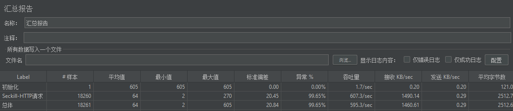
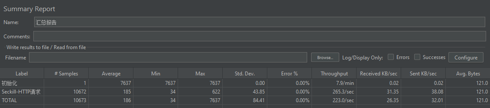
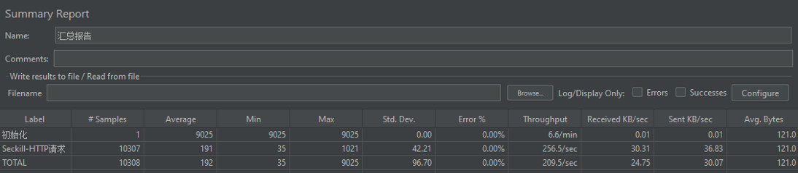
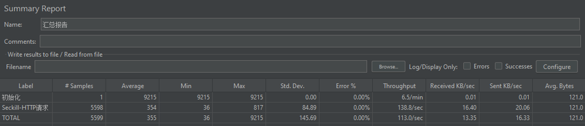

## 秒杀系统

### 1.秒杀之MySQL实现

优点： 实现简单，依赖MySQL事务控制，也不会超卖。

缺点： 流量(有效流量，无效流量)直接打到MySQL,MySQL压力大，扛不住就容易奔溃，并且容易雪崩。

解决方案： 将无效流量过滤掉，引入redis.

### 2.秒杀之Redis缓存 版本1

优点： redis为数据库抵挡了无效流量，减轻了数据库压力。

缺点： 压力转移到了redis, redis中的库存数量会减为负数，redis的自减操作也会给redis带来压力。

解决方案：减少redis的自建操作，利用redis string类型特殊，会先校验类型是否为数值类型，才进行自减，
所以在库存减为0的时候，将值改成字符串，redis就不会进行自减了，但程序需要通过捕获异常处理业务。

### 3.秒杀之Redis缓存 版本2

优点：redis为数据库抵挡了无效流量，减轻了数据库压力，并且redis不会进行自减操作。

缺点：高并发情况下，还是会触发redis的自减操作。

解决方案：引入SingleThreadExecutor，相同/同类商品和线程数取模，通过线程池处理，减少高并发情况下redis发生自减操作。

解决方案：

### 4.秒杀之Thread V1版本

优点：redis为数据库抵挡了无效流量，减轻了数据库压力，并且redis不会进行自减操作。

缺点：代码复杂度高了，并且秒杀同一个商品，只能一个线程处理，性能低了。

解决方案：相同商品，分组处理，如：商品编号为：10001，名称为：HUAWEI P50 PRO， 库存100台，如果需要支持4个线程同时可以秒杀，
秒杀前先初始化redis,key为：10001_1,10001_2,10001_3,10001_4,value都是25台，mysql也如此处理。（保证总库存数和线程数可以整除就好了）

### 4.秒杀之Thread V2版本

